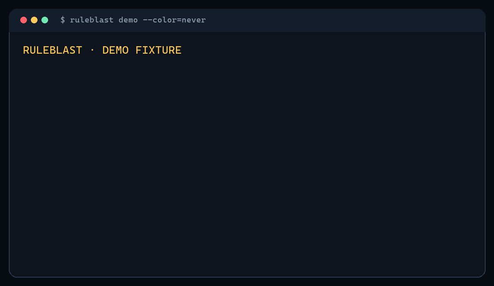

# RuleBlast

**DEMO FIXTURE**

## 9 instruction-line edits. 1,842 tracked paths changed stack.

### 1,229 paths now live in two AI realities.

Git shows the first diff. RuleBlast finds the second.

That result comes from a packaged, deterministic change to `AGENTS.md` and `CLAUDE.md`, projected across 3,906 synthetic Git-tracked paths. Codex and Claude Code can share a repository without receiving the same repository instructions. RuleBlast makes that difference inspectable—locally, without calling a model, and with every counted path tied back to its sources.

## Install

The commands below define the exact `1.0.0` install interface. First verify that npm exposes the pinned version; a source checkout never proves registry availability. RuleBlast requires Node.js 20 or newer:

```bash
node --version
npm view ruleblast@1.0.0 version
```

When npm reports `1.0.0`, the shortest path needs no permanent global install. `npx` downloads and runs the complete pinned package through npm's cache:

```bash
npx ruleblast@1.0.0 --help
cd <your-git-repository>
npx ruleblast@1.0.0
```

`--help` works from any directory. Analysis commands require a Git repository; `NOT_REPOSITORY` means to `cd` into one first. If a diff reports `REF_NOT_FOUND`, replace `HEAD~1` with an existing commit or ref from that repository.

A global install will download the full CLI once and expose `ruleblast` on your command path:

```bash
npm install --global ruleblast@1.0.0
ruleblast --help
ruleblast
```

For a repository-owned tool version, install it locally and commit the resulting package lock:

```bash
npm install --save-dev ruleblast@1.0.0
npx ruleblast --help
npx ruleblast
```

These npm commands work in PowerShell or Command Prompt on Windows and in bash or zsh on macOS and Linux. The four v1 actions stay available through the one-command form:

```bash
# scan the current repository
npx ruleblast@1.0.0 .

# compare a base commit with the tracked worktree
npx ruleblast@1.0.0 diff HEAD~1

# explain one tracked path across that transition
npx ruleblast@1.0.0 explain packages/api/internal/refund.ts --from HEAD~1

# run the packaged teaching fixture
npx ruleblast@1.0.0 demo
```

`npm install` is also the exact-version upgrade or reinstall operation. Remove the selected installation scope explicitly:

```bash
# upgrade or reinstall the global CLI at the pinned version
npm install --global ruleblast@1.0.0

# remove the global CLI
npm uninstall --global ruleblast

# upgrade or reinstall the project-local CLI at the pinned version
npm install --save-dev ruleblast@1.0.0

# remove the project-local CLI
npm uninstall --save-dev ruleblast
```

If a global install reports a permission error, use the `npx` or project-local form instead of elevating the installer. If npm reports damaged cache metadata, verify the cache and retry the exact version:

```bash
npm cache verify
npx ruleblast@1.0.0 --help
```

For a source build, use the `v1.0.0` release-source tag after it is visible on GitHub. This path still requires npm dependency access or a populated npm cache; it is not a workaround for a complete registry outage:

```bash
git clone --branch v1.0.0 --depth 1 https://github.com/Kpoiut/ruleblast.git
cd ruleblast
npm ci
npm run build
node dist/cli.js --help
node dist/cli.js .
```

## Verified public-repository receipt — not a demo fixture

RuleBlast has also captured its own public repository across two immutable commits: [`27d52e2cd6eeb25d9b395351fc2212e2d48cb7c8`](https://github.com/Kpoiut/ruleblast/commit/27d52e2cd6eeb25d9b395351fc2212e2d48cb7c8) → [`e420008a1c10c5c328e506247560117f4d40b855`](https://github.com/Kpoiut/ruleblast/commit/e420008a1c10c5c328e506247560117f4d40b855).

The 33 instruction-line edits changed the projected stack for all 106 of 106 tracked candidate paths. Both pinned profiles changed on all 106 paths, while the two resulting profile payloads remained aligned: zero current split paths, zero partial paths, zero unknown paths, and zero indeterminate paths. That distinction matters—a repository-wide blast does not necessarily create two different rule realities.

The checked-in [canonical receipt](cases/kpoiut__ruleblast/27d52e2cd6ee..e420008a1c10.json) binds those metrics to immutable refs, resolver revision 1, core digest `1e907a88ed648ebbd68b4f588c3bd09058ab7714e8f85a3f2d4a1c60e5a40938`, and producer provenance without copying source contents. Its `npx ruleblast@1.0.0 ...` reproduction command pins the release interface; the producer fields continue to describe the historical development commit that captured the receipt.

## Terminal transcript — DEMO FIXTURE

This is production CLI output over the packaged fixture, not prewritten animation:



```text
RULEBLAST · DEMO FIXTURE

9 instruction-line edits.

1,842
tracked paths changed stack.

1,229 paths now live in two AI realities.

The largest fracture starts at packages/api/internal/.

Pick one path. See every source:
  ruleblast demo --explain packages/api/internal/refund.ts

Scope: 3,906 tracked paths · repository-only · resolver revision 1
```

## Explain one path

The reveal is a doorway, not the proof. Drill into the same demo and inspect each selected, empty, imported, applied, excluded, or unresolved source:

```bash
npx ruleblast@1.0.0 demo --explain packages/api/internal/refund.ts
```

<details>
<summary>Demo provenance and exact reproduction</summary>

The checked-in recipe is [`fixtures/demo/case.json`](fixtures/demo/case.json). It expands into immutable before/after fixture snapshots, then passes through the same profile, impact, and text-rendering path as repository analysis. The generator validates the checked-in recipe and recomputes the result; terminal copy does not own a second set of counts.

Run the source proof:

```bash
git clone https://github.com/Kpoiut/ruleblast.git
cd ruleblast
git checkout --detach 27d52e2cd6eeb25d9b395351fc2212e2d48cb7c8
npm ci
npm run build
node scripts/generate-demo.mjs
node dist/cli.js demo --json
node dist/cli.js demo --explain packages/api/internal/refund.ts --color=never
```

The fixture implementation entered main at immutable Git revision [`27d52e2cd6eeb25d9b395351fc2212e2d48cb7c8`](https://github.com/Kpoiut/ruleblast/commit/27d52e2cd6eeb25d9b395351fc2212e2d48cb7c8). Reproduce the versioned artifact without a mutable distribution alias:

```bash
npx ruleblast@1.0.0 demo --json
npx ruleblast@1.0.0 demo --explain packages/api/internal/refund.ts
```

The synthetic inventory contains 613 matching-change paths, 1,229 Codex-only change paths, and 2,064 unaffected paths. Their sum and every headline count are asserted by [`test/demo.test.ts`](test/demo.test.ts).

</details>

## Scope

RuleBlast v1 is deliberately one small instrument:

| In | Out |
|---|---|
| Git commit and tracked-worktree snapshots | untracked, ignored, user, managed, or session instructions |
| Codex CLI and Claude Code CLI repository projections | editor, hosted, or similarly branded surfaces with different semantics |
| `scan`, `diff`, `explain`, and `demo` actions | mutation, sync, generation, scoring, or auto-fix |
| deterministic text and canonical JSON | network calls, model calls, telemetry, dashboard, or product UI |

An unresolved boundary remains visible as `PARTIAL`, `UNKNOWN`, or `INDETERMINATE`; it is never cleaned up for a stronger headline.

Read the stable [behavior and result contract](CONTRACT.md) for the exact comparison context, metric definitions, evidence boundary, and non-claims.

## How it works

1. Capture a deterministic snapshot from a Git commit, the tracked worktree, or the packaged fixture.
2. Project each tracked path through evidence-pinned profile semantics for `openai/codex-cli@1` and `anthropic/claude-code-cli@1`.
3. Compare normalized repository payloads and projection fingerprints without guessing through unknown order or unsupported boundaries.
4. Render the blast, then keep each count traceable to path transitions, changed instruction sources, and findings.

The core stays profile-neutral: resolver adapters produce the same canonical projection shape, and the impact engine does not branch on vendor names.

## Examples

The optional positional path is a filesystem starting point used to discover the repository; scan still analyzes the repository's tracked candidate inventory.

```bash
# Inspect the current tracked repository
npx ruleblast@1.0.0 .

# Discover the repository from a nested filesystem path, then scan it
npx ruleblast@1.0.0 packages/api/internal

# Compare a commit with the tracked worktree
npx ruleblast@1.0.0 diff HEAD~1

# Inspect one path across that transition
npx ruleblast@1.0.0 explain packages/api/internal/refund.ts --from HEAD~1

# Emit deterministic machine-readable output
npx ruleblast@1.0.0 diff HEAD~1 --json
```

## Contribute a Blast Case

The most useful contribution is one small result that challenges the resolver or makes the second diff surprising. A Blast Case is atomic: official evidence, retrieval date, before manifest, after manifest, expected canonical JSON, and one sentence explaining the surprise.

Promoted public-repository evidence lives under [`cases/`](cases/README.md) as a source-content-free canonical receipt: immutable refs, resolver revision, result core, digest, producer provenance, and an exact versioned reproduction command. The capture tool analyzes an existing checkout through the same production pipeline and derives the receipt path; it cannot overwrite an accepted case. The first receipt passed the field-pilot gate; the synthetic fixture remains a separately labeled teaching surface and can never stand in for real evidence.

See [CONTRIBUTING.md](CONTRIBUTING.md) for immutable-ref, publication-permission, rejection, and test requirements, or open a focused [wrong blast](.github/ISSUE_TEMPLATE/wrong-blast.yml), [missing blast](.github/ISSUE_TEMPLATE/missing-blast.yml), [weird blast](.github/ISSUE_TEMPLATE/weird-blast.yml), or [profile evidence](.github/ISSUE_TEMPLATE/profile-evidence.yml) form.

## Roadmap

The `1.0.0` release tree fixes the package identity, install interface, pack-once artifact, packed-install proof, field pilot, and first real receipt. Registry, tag, and GitHub Release availability remain independently verifiable external facts rather than claims inferred from repository prose. Future stages are labeled by maturity and evidence gate rather than dates.

Today: Codex + Claude Code.

The profile seam is already there for the rest.

Two agents share this repo.
How many rule realities are still hiding in it…?

Read [ROADMAP.md](ROADMAP.md) for the release gates, Ground-Truth Hardening, Blast Receipts, one evidence-gated third reality, declarative Reality Packs, and an eventual many-reality diff. Candidate surfaces are not current support.

RuleBlast is licensed under [Apache-2.0](LICENSE). Changes are recorded in [CHANGELOG.md](CHANGELOG.md).
