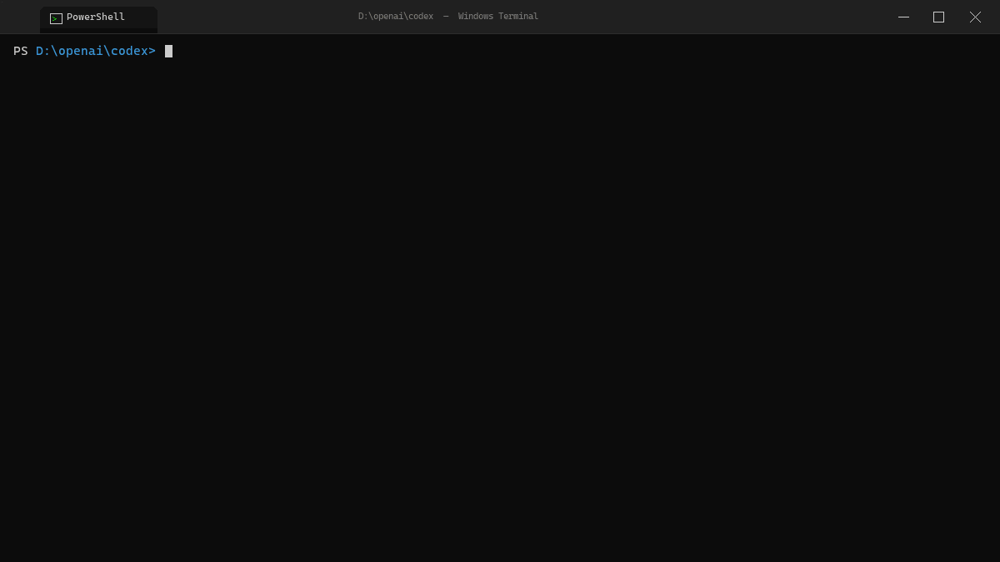
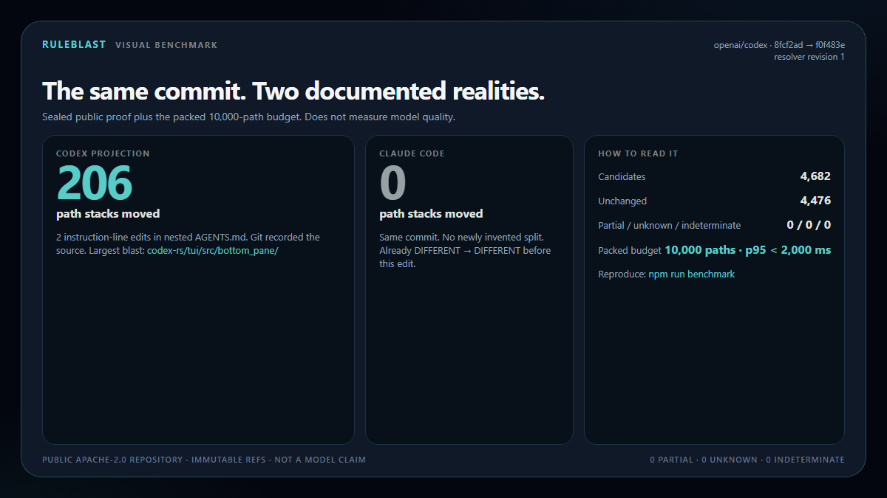

<h1 align="center">RuleBlast — Git diff for invisible repository instructions</h1>

<p align="center">
  
</p>

<p align="center">
  <a href="https://github.com/Kpoiut/ruleblast/actions/workflows/verify.yml"></a>
  <a href="https://www.npmjs.com/package/ruleblast"></a>
  
  <a href="LICENSE"></a>
</p>

<p align="center">
  Git shows the <code>AGENTS.md</code> and <code>CLAUDE.md</code> edit. RuleBlast shows the second diff: every tracked path that inherits it.<br>
  <sub>Local · read-only · deterministic · no network or model call</sub>
</p>

<p align="center">
  
</p>

<p align="center">
  You changed 2 lines in <code>AGENTS.md</code>.<br>
  <strong>Codex: 206 path stacks moved. Claude Code: 0.</strong><br>
  Git will never show that second diff.
</p>

<p align="center"><strong>2 instruction-line edits. Codex: 206 path stacks moved. Claude Code: 0.</strong></p>

## Two lines. 206 path stacks. One exact cause.

One Git tree. Two documented instruction realities. Delete two instruction lines. **Codex changed: 206 · Claude Code changed: 0.** 206 tracked paths changed stack. That is the shock. Profiles were already `DIFFERENT → DIFFERENT`; no path newly split. We do not invent a split.

| Git records | RuleBlast reveals |
|---|---|
| 3 files, 6 deleted lines | 2 instruction-line edits |
| 1 changed instruction source | 206 tracked paths changed stack |
| — | 4,476 tracked paths remained unchanged |
| — | Codex changed: 206 · Claude Code changed: 0 |

See that second diff on your repository first:

```bash
npx --yes ruleblast@1.3.0 .
```

## Visual benchmark

<p align="center">
  
</p>

Same sealed `openai/codex` proof. Same packed 10,000-path budget. It does not measure model quality.

| What to look at | Number | How to explain it |
|---|---:|---|
| Instruction-line edits Git can see | 2 | The first diff |
| Codex path stacks moved | 206 | The documented Codex projection changed |
| Claude Code path stacks moved | 0 | The same commit, the other reality |
| Unchanged tracked paths | 4,476 | The blast was local, not the whole tree |
| Packed performance budget | 10,000 nested paths, p95 < 2,000 ms | `npm run benchmark` |

Pinned public [`openai/codex`](https://github.com/openai/codex/compare/8fcf2ad931b90589dd29a571f367e3185d26bbe0...f0f483e8b2a2630bf8dfa5f8451e81eba20def6c) refs [`8fcf2ad…`](https://github.com/openai/codex/commit/8fcf2ad931b90589dd29a571f367e3185d26bbe0) → [`f0f483e…`](https://github.com/openai/codex/commit/f0f483e8b2a2630bf8dfa5f8451e81eba20def6c). Profiles `openai/codex-cli@1` and `anthropic/claude-code-cli@1` were already `DIFFERENT → DIFFERENT`; no path newly split across profiles. One exact cause: [`codex-rs/tui/src/bottom_pane/action_required_title.rs`](https://github.com/openai/codex/blob/f0f483e8b2a2630bf8dfa5f8451e81eba20def6c/codex-rs/tui/src/bottom_pane/action_required_title.rs) under nested [`AGENTS.md`](https://github.com/openai/codex/blob/8fcf2ad931b90589dd29a571f367e3185d26bbe0/codex-rs/tui/src/bottom_pane/AGENTS.md). zero partial, zero unknown, and zero indeterminate. Not a claim about model compliance or response behavior.

```bash
ruleblast diff 8fcf2ad931b90589dd29a571f367e3185d26bbe0 --to f0f483e8b2a2630bf8dfa5f8451e81eba20def6c
```

Sealed on implementation [`517cc07…`](https://github.com/Kpoiut/ruleblast/commit/517cc07af9d2d7dafb48b9f2b3cfaecd85444a1d): 150,404,342 canonical bytes, SHA-256 `5659e4cb83051aeaa246c3b45fad75698754806db30f4e710849d220d12ee9d2`. License at [`f73a072…/LICENSE`](https://github.com/openai/codex/blob/f73a07224653c2cc775b3f84f129b872b1e08f85/LICENSE).

Ten-second teaching receipt — different artifact (33→106 on this repo), not the 206 proof:

```bash
npx --yes ruleblast@1.3.0 case
```

## Install

Published CLI is `ruleblast@1.3.0`. Node.js 20+. `npx` downloads and runs the pinned package. A global install downloads the full CLI.

```bash
node --version
npm view ruleblast@1.3.0 version
cd <your-git-repository>
npx --yes ruleblast@1.3.0 .
npx --yes ruleblast@1.3.0 --help
```

```bash
npm install --global ruleblast@1.3.0
ruleblast --version
ruleblast --help
ruleblast
```

```bash
npm install --save-dev --save-exact ruleblast@1.3.0
npx ruleblast --version
npx ruleblast --help
npx ruleblast
```

`NOT_REPOSITORY` means `cd` into a Git repo first. `REF_NOT_FOUND` means pick a real ref. On a permission error, use `npx` instead of elevating. Release CI is Windows and Linux.

```bash
npx --yes ruleblast@1.3.0 diff HEAD~1
npx --yes ruleblast@1.3.0 explain src/args.ts --from HEAD~1
npx --yes ruleblast@1.3.0 case
```

<details>
<summary>Uninstall, cache, source build</summary>

```bash
npm uninstall --global ruleblast
npm install --global ruleblast@1.3.0
npm uninstall --save-dev ruleblast
npm install --save-dev --save-exact ruleblast@1.3.0
npm cache verify
npx --yes ruleblast@1.3.0 --help
git clone --branch v1.3.0 --depth 1 https://github.com/Kpoiut/ruleblast.git
cd ruleblast
npm ci --ignore-scripts
npm run build
node dist/cli.js --version
node dist/cli.js --help
node dist/cli.js .
node dist/cli.js case --json
```

The `1.0.1 → 1.0.2` registry upgrade was verified by the guarded [eight-cell release workflow](https://github.com/Kpoiut/ruleblast/actions/runs/31722775046).

</details>

## Run the verified case

Packaged teaching receipt: [`27d52e2…`](https://github.com/Kpoiut/ruleblast/commit/27d52e2cd6eeb25d9b395351fc2212e2d48cb7c8) → [`e420008…`](https://github.com/Kpoiut/ruleblast/commit/e420008a1c10c5c328e506247560117f4d40b855). 33 instruction-line edits. 106 of 106 stacks moved. Zero current split, partial, unknown, or indeterminate paths. [Canonical receipt](cases/kpoiut__ruleblast/27d52e2cd6ee..e420008a1c10.json) core digest `1e907a88ed648ebbd68b4f588c3bd09058ab7714e8f85a3f2d4a1c60e5a40938`.

```bash
npx --yes ruleblast@1.3.0 case
npx --yes ruleblast@1.3.0 case --json
npx --yes ruleblast@1.3.0 case --explain .github/ISSUE_TEMPLATE/missing-blast.yml
```

<details>
<summary><strong>Exact packaged-case terminal transcript</strong></summary>

```text
RULEBLAST · VERIFIED CASE · kpoiut/ruleblast · 27d52e2cd6ee → e420008a1c10

33 instruction-line edits.

106
tracked paths changed stack.

No paths newly split across profiles.

The largest blast starts at ./.

Pick one path. See every source:
  ruleblast case --explain .github/ISSUE_TEMPLATE/missing-blast.yml

Scope: 106 tracked paths · repository-only · resolver revision 1
```

</details>

## Explain one path

```bash
npx --yes ruleblast@1.3.0 case --explain .github/ISSUE_TEMPLATE/missing-blast.yml
```

Historical reproduction (needs both commits checked out):

```bash
npx ruleblast@1.0.0 diff 27d52e2cd6eeb25d9b395351fc2212e2d48cb7c8 --to e420008a1c10c5c328e506247560117f4d40b855 --json
```

## Scope

| In | Out |
|---|---|
| Git commit and tracked-worktree snapshots | untracked, ignored, user, managed, or session instructions |
| Codex CLI, Claude Code CLI, and opt-in Copilot CLI repository projections | editor, hosted, or similarly branded surfaces |
| `scan`, `diff`, `explain`, and `case` | mutation, sync, generation, scoring, or auto-fix |
| deterministic text and canonical JSON | network calls, model calls, telemetry, dashboard, or product UI |

Unresolved stays `PARTIAL`, `UNKNOWN`, or `INDETERMINATE`. Contract: [CONTRACT.md](CONTRACT.md). Agents after install: [AGENT_USAGE.md](AGENT_USAGE.md).

## How it works

Snapshot → evidence-pinned Codex/Claude projection → compare payloads → render the blast. Adapters own vendor rules. Impact stays profile-neutral.

## Examples

The optional path is only a filesystem starting point for repository discovery. Add `--witness` when you need why-edges. Add `--receipt` when you need a pasteable card. Add `--reality github/copilot-cli@1` when you need that third documented surface. Default `--json` stays the two-profile canonical result.

```bash
npx --yes ruleblast@1.3.0 .
npx --yes ruleblast@1.3.0 packages/api/internal
npx --yes ruleblast@1.3.0 diff HEAD~1
npx --yes ruleblast@1.3.0 explain src/args.ts --from HEAD~1
npx --yes ruleblast@1.3.0 diff HEAD~1 --json
```

## Give your agent RuleBlast

Codex discovers repository skills from `.agents/skills`, not from `node_modules`. Copy [`.agents/skills/ruleblast/SKILL.md`](.agents/skills/ruleblast/SKILL.md) into your repo. Then an agent that hits an `AGENTS.md` / `CLAUDE.md` blast can run `npx --yes ruleblast@1.3.0` without you re-explaining the four routes.

## Show a blast on a pull request

Optional. Not a hosted product. The runner only executes the published CLI.

```yaml
- uses: actions/checkout@v4
  with:
    fetch-depth: 0
- uses: Kpoiut/ruleblast@main
```

The action posts a `--receipt` comment for `base.sha → head.sha`. Pin a commit instead of `@main` after you trust the workflow.

## Contribute a Blast Case

Fast lane: [surprising result](https://github.com/Kpoiut/ruleblast/issues/new?template=surprising-result.yml) — command, observed text, one sentence. No canonical JSON.

Promoted Blast Case: official evidence, retrieval date, manifests, expected JSON. The 25-commit pilot is only for packaging `case`, not for a first PR. [CONTRIBUTING.md](CONTRIBUTING.md).

## Roadmap

Today: Codex, Claude Code, and opt-in GitHub Copilot CLI.

The profile seam is already there for the rest.

Two agents share this repo.
How many rule realities are still hiding in it…?

Read [ROADMAP.md](ROADMAP.md). Apache-2.0. [CHANGELOG.md](CHANGELOG.md).

[Code of conduct](CODE_OF_CONDUCT.md) · [Contributing](CONTRIBUTING.md) · [Security](SECURITY.md)
